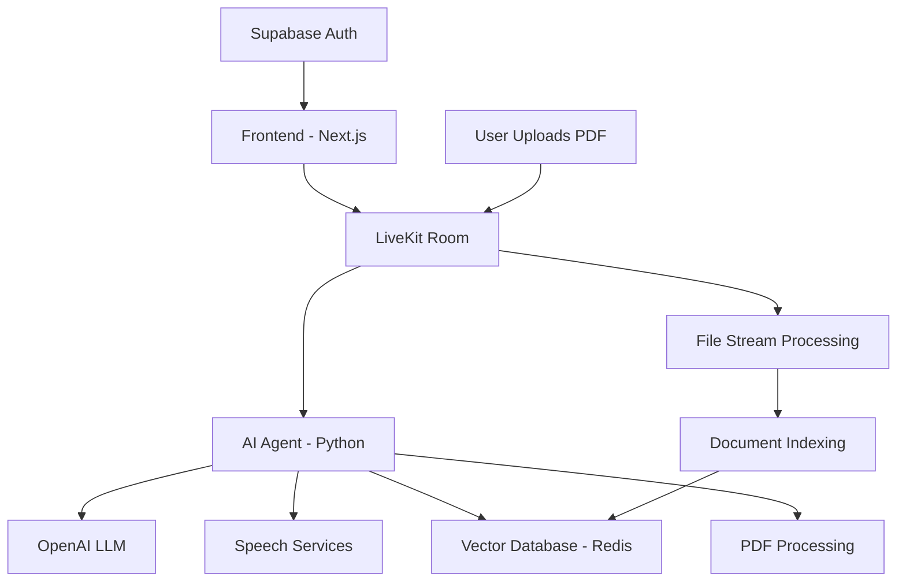

# 🤖 AI Voice Assistant with PDF Analysis

A sophisticated real-time voice assistant application that enables users to upload PDF documents and have natural voice conversations about their content. Built with cutting-edge AI technologies and modern web frameworks.


## Check out my announcement on LinkedIn showcasing the real‑time Voice‑to‑Voice AI Agent built with LiveKit and Redis:
🔗 [Built a Real-time Voice‑to‑Voice AI Agent for documents – LinkedIn](https://www.linkedin.com/posts/ramzirebai_ai-voiceai-livekit-activity-7345431004230168577-0-Uy)


## ✨ Features

### 🎯 Core Functionality
- **Real-time Voice Interaction**: Natural voice conversations with AI assistant
- **PDF Document Analysis**: Upload and analyze PDF documents through voice commands
- **Intelligent Q&A**: Ask questions about uploaded documents and get accurate answers
- **Chat History Persistence**: Conversation history saved and restored across sessions
- **Multi-user Support**: Secure user authentication and personalized experiences

### 🎨 User Experience
- **Modern Chat Interface**: Beautiful, responsive chat UI with real-time message streaming
- **Live Transcription**: Real-time speech-to-text with typing indicators
- **Visual Feedback**: Animated agent states (listening, thinking, speaking)
- **Drag & Drop Upload**: Intuitive PDF upload with progress tracking
- **Dark/Light Mode**: Adaptive theming for better user experience

### 🔧 Technical Features
- **RAG (Retrieval Augmented Generation)**: Advanced document retrieval for accurate responses
- **Vector Search**: Semantic search through document content using embeddings
- **Real-time Audio Processing**: Low-latency voice communication
- **Auto-scroll Chat**: Smart scrolling to latest messages
- **File Validation**: Secure PDF upload with size and type validation

## 🏗️ Architecture



## 🛠️ Technologies Used

### Frontend
- **[Next.js 14](https://nextjs.org/)** - React framework with App Router
- **[TypeScript](https://www.typescriptlang.org/)** - Type-safe development
- **[Tailwind CSS](https://tailwindcss.com/)** - Utility-first CSS framework
- **[Framer Motion](https://www.framer.com/motion/)** - Animation library
- **[LiveKit Components](https://livekit.io/)** - Real-time communication
- **[Supabase](https://supabase.com/)** - Authentication and user management

### Backend (AI Agent)
- **[Python 3.9+](https://python.org/)** - Core runtime
- **[LiveKit Agents](https://livekit.io/)** - Real-time AI agent framework
- **[OpenAI GPT-4](https://openai.com/)** - Large Language Model
- **[LangChain](https://langchain.com/)** - LLM application framework
- **[Redis Vector Store](https://redis.io/)** - Vector database for embeddings
- **[PyMuPDF4LLM](https://pymupdf.readthedocs.io/)** - PDF processing

### AI Services
- **[OpenAI Embeddings](https://platform.openai.com/docs/guides/embeddings)** - Text embeddings
- **[Deepgram STT](https://deepgram.com/)** - Speech-to-Text
- **[OpenAI TTS](https://platform.openai.com/docs/guides/text-to-speech)** - Text-to-Speech
- **[Silero VAD](https://github.com/snakers4/silero-vad)** - Voice Activity Detection

## 🚀 Getting Started

### Prerequisites
- Node.js 18+ and npm/yarn
- Python 3.9+
- Redis instance (local or cloud)
- API keys for OpenAI, Deepgram, and LiveKit


3. **Configure environment variables**
Create `.env.local` file in the frontend directory:
```env
NEXT_PUBLIC_LIVEKIT_URL=wss://your-livekit-instance.livekit.cloud
NEXT_PUBLIC_CONN_DETAILS_ENDPOINT=/api/connection-details
NEXT_PUBLIC_SUPABASE_URL=your-supabase-url
NEXT_PUBLIC_SUPABASE_ANON_KEY=your-supabase-anon-key
```

4. **Set up the AI agent**
Navigate to the agent directory and install Python dependencies:
```bash
cd ../first_practice
pip install -r requirements.txt
```

Configure agent environment variables:
```env
OPENAI_API_KEY=your-openai-api-key
DEEPGRAM_API_KEY=your-deepgram-api-key
LIVEKIT_API_KEY=your-livekit-api-key
LIVEKIT_API_SECRET=your-livekit-secret
LIVEKIT_URL=wss://your-livekit-instance.livekit.cloud
```

### Running the Application

1. **Start the AI agent**
```bash
cd first_practice
python agent.py
```

2. **Start the frontend development server**
```bash
cd voice-assistant-frontend
npm run dev
```

3. **Access the application**
Open [http://localhost:3000](http://localhost:3000) in your browser

## 📱 Usage

1. **Authentication**: Sign in using the authentication system
2. **Upload PDF**: Drag and drop or select a PDF document
3. **Start Conversation**: Click "Start Conversation" to connect to the AI agent
4. **Voice Interaction**: 
   - Speak naturally to ask questions about your document
   - The AI will process your speech and respond with relevant information
   - View the conversation history in the chat interface
5. **Document Analysis**: Ask for summaries, specific information, or analysis of your PDF content

## 🎯 Key Features Showcase

### Real-time Voice Processing
- **Low Latency**: Sub-second response times for voice interactions
- **Natural Conversations**: Context-aware responses with conversation memory
- **Live Transcription**: Real-time speech-to-text with visual feedback
- **Typing Indicators**: See when the AI is processing your request
### PDF Document Handling
- **Drag & Drop Upload**: Easy PDF upload with progress tracking
- **Document Indexing**: Efficient indexing of PDF content for fast retrieval
- **Semantic Search**: Ask questions in natural language and get accurate answers
- **Contextual Understanding**: AI understands context and provides relevant responses
## 📜 License
This project is licensed under the MIT License. See the [LICENSE](LICENSE) file for details.
